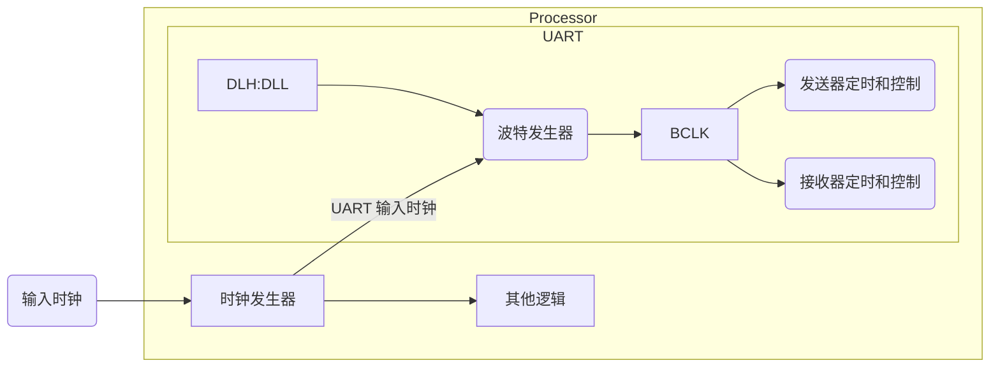

# 1. 介绍

universal asynchronous receiver-transmitter (UART)

以下各节概述了该系统的主要组件和功能。通用异步接收器/发送器 (UART) 外设。

## 1.1 外设用途

通用异步接收器/发送器 (UART) 外设基于行业标准 TL16C550 异步通信元件，这反过来是 TL16C450 的功能升级。
功能上类似于 TL16C450 电源 up（单字符或 TL16C450 模式），UART 可以放置在备用 FIFO 中(TL16C550) 模式。
这通过缓冲减轻了 CPU 过多的软件开销接收和发送的字符。
接收器和发送器 FIFO 最多可存储 16 个字节，包括接收器 FIFO 的每字节三个额外的错误状态位。
UART 对从外设接收的数据执行串并转换从 CPU 接收到的数据的设备和并行到串行转换。
CPU 可以随时读取 UART 状态。UART 包括控制能力和一个可以定制的处理器中断系统，以最大限度地减少软件管理通信链路。
UART 包括一个可编程波特发生器，能够将 UART 分频输入时钟由 1 到 65535 的除数产生一个 16× 参考时钟或一个 13× 内部发送器和接收器逻辑的参考时钟。
有关详细的时间和有关 UART 的电气规范，请参阅特定于设备的数据手册。

## 1.2 特点

查看特定于设备的数据手册以查看支持的功能列表和 UART 不支持的。

### 1.4 行业标准合规声明

UART 外设基于行业标准 TL16C550 异步通信元件，是 TL16C450 的功能升级。这本文档中的信息假定您熟悉这些标准。

# 2. 架构

## 2.1 时钟产生和控制

UART 位时钟来源于自 UART 输入的时钟。

处理器时钟发生器接收来自外部时钟源的信号，并产生具有编程频率的 UART 输入时钟。
UART 包含一个可编程波特发生器，它接收输入时钟并将其除以 1 到 65535 范围内的除数以产生波特时钟 (BCLK)。

BCLK 的频率是波特率的十六倍（16×）（每个接收或发送的位持续 16 个 BCLK 周期）或波特率的十三倍（13×）（每个接收或发送的位持续 13 个 BCLK 周期）。
当 UART 正在接收时，对于 16x 过采样模式在第 8 个 BCLK 周期对位进行采样，对于 13x 过采样模式在第 6 个 BCLK 周期采样。



通过配置模式定义寄存器（MDR）中的 OSM_SEL 位来选择 16× 或 13× 参考时钟。计算除数的公式是：

$$
Divisor= \frac{UART Input Clock Frequency}{Desired Baud Rate \times 16}  [MDR.OSM_SEL = 0]
$$

$$
Divisor= \frac{UART Input Clock Frequency}{Desired Baud Rate \times 13}  [MDR.OSM_SEL = 1]
$$

或者

$$
除数[DLH:DLL] = 输入时钟频率 / 目标波特率 / 16
$$

两个 8 位寄存器字段（DLH 和 DLL），称为除数锁存器，保存这个 16 位除数。
DLH 保存这个 16 位除数的高 8bit，DLL 保存 16 位除数的低 8bit。

有关这些寄存器字段的信息，请参阅第 3.11 节。
这些除数锁存器必须在 UART 初始化期间加载，以确保波特率发生器的所需操作。
写入除数锁存器会导致在写入访问期间插入两个等待状态，同时波特发生器加载新值。

$$
{n} \times {UART input clock cycles} = 1 \times BCLK (n = DLH:DLL);
$$

$$
16 \times BCLK = 1 \times TXD/RXD bit;
$$

1. n 个 UART 输入时钟周期产生一个 BCLK 时钟； n 为设置在寄存器 DLH:DLL 的频率除数
2. 16 个 BCLK 传输一个 bit，在数据接收时，UART 在第 8 个 BCLK 周期采样。

上面总结了传输的数据位、BCLK 和 UART 输入时钟之间的关系。时序关系显示每个位持续 16 个 BCLK 周期。 这是 16x 过采样模式的情况。

对于 13x 过采样模式，每个位持续 13 个 BCLK 周期

150MHz UART 输入时钟和 16x 过采样模式的波特率示例:

| 波特率  | 除数 | 实际波特率 | 误差 (%) |
| ------- | ---- | ---------- | -------- |
| 2400    | 3906 | 2400.154   | 0.01     |
| 4800    | 1953 | 4800.372   | 0.01     |
| 9600    | 977  | 9595.701   | –0.04    |
| 19200   | 488  | 19211.066  | 0.06     |
| 38400   | 244  | 38422.131  | 0.06     |
| 56000   | 167  | 56137.725  | 0.25     |
| 128000  | 73   | 129807.7   | 0.33     |
| 3000000 | 3    | 3125000    | 4.00     |

150MHz UART 输入时钟和 13x 过采样模式的波特率示例:

| 波特率  | 除数 | 实际波特率  | 误差 (%) |
| ------- | ---- | ----------- | -------- |
| 2400    | 4808 | 2399        | –0.01    |
| 4800    | 2404 | 4799.646    | –0.01    |
| 9600    | 1202 | 9599.386    | –0.01    |
| 19200   | 601  | 19198.771   | –0.01    |
| 38400   | 300  | 38461.538   | 0.16     |
| 56000   | 206  | 56011.949   | 0.02     |
| 128000  | 90   | 128205.128  | 0.16     |
| 3000000 | 4    | 2884615.385 | –4.00    |

## 2.2 信号说明

UART 使用最少数量的信号连接与外部设备接口。 请注意，UART 的数量及其支持的功能因设备而异，有关详细信息，请参阅特定于设备的数据手册。

| 信号名称$^1$   | 信号类型 | 功能             |
| -------------- | -------- | ---------------- |
| UARTn_TXD      | 输出     | 串行数据发送     |
| UARTn_RXD      | 输入     | 串行数据接收     |
| UARTn_CTS $^2$ | 输入     | 清除发送握手信号 |
| UARTn_RTS $^2$ | 输出     | 请求发送握手信号 |

1. n 表示适用的 UART； 即 UART0、UART1 等。
2. 并非所有 UART 都支持该信号。 请参阅特定于设备的数据手册以检查它是否受支持。

## 2.3 引脚复用

广泛的引脚复用用于在尽可能小的封装中容纳最多的外设功能。 引脚复用通过设备复位时的硬件配置和软件可编程寄存器设置的组合进行控制。 请参阅特定于设备的数据手册以确定引脚多路复用如何影响 UART。

## 2.4 协议描述

### 2.4.1 传输

UART 发送器部分包括一个发送器保持寄存器（THR）和一个发送器移位寄存器（TSR）。
当 UART 处于 FIFO 模式时，THR 是一个 16 字节的 FIFO。发送器部分控制是 UART 线路控制寄存器 (LCR) 的一个功能。
根据在 LCR 中选择的设置，UART 发送器向接收设备发送以下内容：

- 1 个起始位
- 5、6、7 或 8 个数据位
- 1 个奇偶校验位（可选）
- 1、1.5 或 2 STOP 位

### 2.4.2 接收

UART 接收器部分包括接收器移位寄存器 (RSR) 和接收器缓冲寄存器 (RBR)。
当 UART 处于 FIFO 模式时，RBR 是一个 16 字节的 FIFO。接收器部分控制是 UART 线路控制寄存器 (LCR) 的一个功能。
根据 LCR 中选择的设置，UART 接收器接受来自发送设备的以下内容：

- 1 个起始位
- 5、6、7 或 8 个数据位
- 1 个奇偶校验位（可选）
- 1 个停止位（任何其他停止位）未检测到与上述数据一起传输

### 2.4.3 数据格式

UART 传输格式如下：

```txt
1 START 位 + 数据位（5, 6, 7, 8）+ 1 PARITY 位（可选）+ STOP 位（1, 1.5, 2）
```

它传输 1 个 START 位； 5、6、7 或 8 个数据位，取决于数据宽度选择； 1 PARITY 位，如果选择了奇偶校验； 和 1、1.5 或 2 个 STOP 位，具体取决于 STOP 位选择。

UART 以下列格式接收：

```txt
1 START 位 + 数据位（5、6、7、8）+ 1 PARITY 位（可选）+ 1 STOP 位
```

它接收 1 START 位； 5、6、7 或 8 个数据位，取决于数据宽度选择； 1 PARITY 位，如果选择了奇偶校验； 和 1 个停止位。

## 2.5 Operation

### 2.5.1 Transmission

UART 发送器部分包括发送器保持寄存器（THR）和发送器移位寄存器（TSR）。
当 UART 处于 FIFO 模式时，THR 是一个 16 字节的 FIFO。发送器部分控制是 UART 线路控制寄存器 (LCR) 的一个功能。
根据 LCR 中选择的设置，UART 发送器向接收设备发送以下内容：

1. 1 START 位
2. 5、6、7 或 8 个数据位
3. 1 PARITY 位（可选）
4. 1、1.5、或 2 个停止位

THR 从内部数据总线接收数据，当 TSR 准备好时，UART 将数据从 THR 移动到 TSR。
UART 将 TSR 中的数据串行化并在 UARTn_TXD 引脚上传输数据。
在非 FIFO 模式下，如果 THR 为空，并且在中断使能寄存器（IER）中使能了 THR 空中断，则会产生中断。
当一个字符加载到 THR 中时，该中断被清除。
在 FIFO 模式下，当发送器 FIFO 为空时产生中断，并在至少一个字节装入 FIFO 时清除中断。

### 2.5.2 Reception

UART 接收器部分包括接收器移位寄存器（RSR）和接收器缓冲寄存器（RBR）。
当 UART 处于 FIFO 模式时，RBR 是一个 16 字节的 FIFO。时序由 16Þ 接收器时钟提供。
接收器部分控制是 UART 线路控制寄存器 (LCR) 的一个功能。根据 LCR 中选择的设置，UART 接收器接受来自发送设备的以下内容：

- 1 个起始位
- 5、6、7 或 8 个数据位
- 1 个奇偶校验位（可选）
- 1 个停止位（没有检测到与上述数据一起传输的任何其他停止位）

RSR 从 UARTn_RXD 引脚接收数据位。然后 RSR 连接数据位并将结果值移动到 RBR（或接收器 FIFO）中。
UART 还在每个接收到的字符旁边存储三位错误状态信息，以记录奇偶校验错误、帧错误或中断。
在非 FIFO 模式下，当一个字符放入 RBR 并且在中断使能寄存器 (IER) 中使能接收器数据就绪中断时，就会产生中断。
当从 RBR 读取字符时，该中断被清除。
在 FIFO 模式下，当 FIFO 填充到 FIFO 控制寄存器 (FCR) 中选择的触发电平时产生中断，当 FIFO 内容低于触发电平时清除中断。

### 2.5.3 FIFO 模式

以下两种模式可用于服务接收器和发送器 FIFO：

- FIFO 中断模式。 FIFO 已启用且相关的中断已启用。 中断被发送到 CPU 以指示特定事件何时发生。
- FIFO 轮询模式。 FIFO 已启用，但相关的中断已禁用。 CPU 轮询状态位以检测特定事件。

由于接收器 FIFO 和发送器 FIFO 是分开控制的，因此可以将其中之一或两者置于中断模式或轮询模式。

#### 2.5.3.1 FIFO 中断模式

当 FIFO 控制寄存器（FCR）中的接收器 FIFO 被使能并且中断使能寄存器（IER）中的接收器中断被使能时，接收器 FIFO 的中断模式被选择。
以下是有关接收器中断的要点：

- 当 FIFO 达到 FCR 中编程的触发电平时，接收器数据就绪中断将发送到 CPU。当 CPU 或 DMA 控制器从 FIFO 中读取足够多的字符，使得 FIFO 低于其编程的触发电平时，它会被清除。
- 接收器线路状态中断是响应溢出错误、奇偶校验错误、帧错误或中断而产生的。该中断的优先级高于接收器数据就绪中断。有关详细信息，请参见第 2.8 节“中断支持”。
- 行状态寄存器 (LSR) 中的数据就绪 (DR) 位指示接收器 FIFO 中字符的存在与否。当字符从接收器移位寄存器 (RSR) 传输到空接收器 FIFO 时，DR 位被设置。 DR 位保持置位，直到 FIFO 再次为空。
- 如果以下所有条件都存在，则会发生接收器超时中断：
  - FIFO 中至少有一个字符，
  - 最近的字符是在超过四个连续字符时间之前接收到的。字符时间是分配给 1 个起始位、n 个数据位、1 个奇偶校验位和 1 个停止位的时间，其中 n 取决于使用线路控制寄存器 (LCR) 中的 WLS 位选择的字长。见表 2-4。
  - 最近一次读取 FIFO 之前已经发生了四个以上连续字符时间。
- 字符时间使用波特率计算。
- 当接收器超时中断发生时，当 CPU 或 EDMA 控制器从接收器 FIFO 中读取一个字符时，该中断被清除并清除超时定时器。如果在 FIFO 中接收到新字符，或者如果电源和仿真管理寄存器 (PWREMU_MGMT) 中的 URRST 位被清除，中断也会被清除。
- 如果接收器超时中断未发生，则在接收到新字符或 CPU 或 EDMA 读取接收器 FIFO 后，超时定时器被清除。

当在 FCR 中使能发送器 FIFO 和在 IER 中使能发送器保持寄存器空中断时，发送器 FIFO 选择中断模式。
当发送器 FIFO 为空时，发送器保持寄存器为空中断发生。
当发送器保持寄存器 (THR) 被加载时它被清零（在为该中断提供服务时可以将 1 到 16 个字符写入发送器 FIFO）。

#### 2.5.3.2 FIFO 轮询模式

当在 FIFO 控制寄存器 (FCR) 中启用接收器 FIFO 并且在中断启用寄存器 (IER) 中禁用接收器中断时，接收器 FIFO 将选择轮询模式。类似地，当发送器 FIFO 使能且发送器中断禁用时，发送的 FIFO 处于轮询模式。在轮询模式下，CPU 通过检查线路状态寄存器 (LSR) 中的位来检测事件：

- RXFIFOE 位指示接收器 FIFO 中是否存在任何错误。
- TEMT 位表示发送器保持寄存器（THR）和发送器移位寄存器（TSR）都为空。
- THRE 位指示 THR 何时为空。
- BI（中断）、FE（帧错误）、PE（奇偶校验错误）和 OE（溢出错误）位指定发生了哪个或哪些错误。
- 只要接收器 FIFO 中至少有一个字节，就会设置 DR（数据就绪）位。

此外，在 FIFO 轮询模式下：

- 中断标识寄存器 (IIR) 不受任何事件的影响，因为中断被禁用。
- UART 不指示何时达到接收器 FIFO 触发电平或何时发生接收器超时。

### 2.5.4 自动流控制

UART 可以通过连接 UARTn_CTS 和 UARTn_RTS 信号来使用自动流控制。
请注意，所有 UART 均不支持自动流控制，有关支持的功能，请参阅特定于设备的数据手册。
在发送器 FIFO 可以发送数据之前，UARTn_CTS 输入必须处于活动状态。
当接收器需要更多数据并通知发送设备时，UARTn_RTS 变为活动状态。
当 UARTn_RTS 连接到 UARTn_CTS 时，除非接收器 FIFO 有数据空间，否则不会发生数据传输。
因此，当如图 2-4 所示连接两个 UART 并启用自动流时，溢出错误将被消除。

#### 2.5.4.1 UARTn_RTS 行为

UARTn_RTS 数据流控制源自接收器块。 当接收器 FIFO 电平达到 1、4、8 或 14 的触发电平时，UARTn_RTS 置为无效。
在达到触发电平后，发送 UART 可能会发送一个附加字节（假设发送 UART 有另一个字节要发送），因为它可能直到它开始发送附加字节后才能识别 UARTn_RTS 的置低。
对于触发级别 1、4 和 8，UARTn_RTS 在接收器 FIFO 清空后自动重新置位。
对于触发级别 14，当接收器 FIFO 低于触发级别时，UARTn_RTS 会自动重新置位。

#### 2.5.4.2 UARTn_CTS 行为

发送器在发送下一个数据字节之前检查 UARTn_CTS。 如果 UARTn_CTS 有效，则发送器发送下一个字节。 要停止发送器发送后续字节，必须在当前发送的最后一个 STOP 位中间之前释放 UARTn_CTS。
当流量控制使能时，UARTn_CTS 电平变化不会触发中断，因为设备会自动控制自己的发送器。
如果没有自动流控制，发送器会发送发送器 FIFO 中存在的任何数据，并可能导致接收器溢出错误。

### 2.5.5 环回控制

可以使用调制解调器控制寄存器 (MCR) 中的 LOOP 位将 UART 置于诊断模式，该寄存器在内部将 UART 输出连接回 UART 输入。
在这种模式下，发送和接收数据路径、发送器和接收器中断以及调制解调器控制中断可以在不连接到另一个 UART 的情况下进行验证。

## 2.6 复位注意事项

### 2.6.1 软件复位注意事项

电源和仿真管理寄存器 (PWREMU_MGMT) 中的两位控制复位 UART 部分：

- UTRST 位仅控制复位发送器。 如果 UTRST = 1，则发送器处于活动状态； 如果 UTRST = 0，发送器处于复位状态。
- URRST 位仅控制复位接收器。 如果 URRST = 1，则接收器处于活动状态； 如果 URRST = 0，接收器处于复位状态。

在每种情况下，将接收器和/或发送器置于复位状态将复位状态机受影响的部分，但不影响 UART 寄存器。

### 2.6.2 硬件复位注意事项

当处理器 RESET 引脚被置位时，整个处理器被复位并保持在复位状态，直到 RESET 引脚被释放。
作为设备复位的一部分，UART 状态机被复位并且 UART 寄存器被强制为其默认状态。
寄存器的默认状态显示在第 3-1 页的第 3 章“寄存器”中。

## 2.7 初始化

UART 初始化需要以下步骤：

1. 执行必要的器件引脚多路复用设置（参见器件特定的数据手册）。
2. 通过将适当的时钟分频值写入分频锁存寄存器（DLL 和 DLH）来设置所需的波特率。
3. 如果要使用 FIFO，请选择所需的触发级别并通过将适当的值写入 FIFO 控制寄存器 (FCR) 来启用 FIFO。在配置 FCR 中的其他位之前，必须先设置 FCR 中的 FIFOEN 位。
4. 通过将适当的值写入线路控制寄存器 (LCR) 来选择所需的协议设置。
5. 如果需要自动流控制，请将适当的值写入调制解调器控制寄存器 (MCR)。请注意，所有 UART 均不支持自动流控制，有关支持的功能，请参阅特定于设备的数据手册。
6. 通过配置 FREE 位选择对仿真挂起事件的所需响应，并通过设置电源和仿真管理寄存器 (PWREMU_MGMT) 中的 UTRST 和 URRST 位来启用 UART。

## 2.8 中断支持

### 2.8.1 中断事件和请求

UART 产生表 2-5 中描述的中断请求。
所有请求都通过仲裁器复用为一个单一的 UART 中断请求给 CPU，如图 2-7 所示。
每个中断请求在中断使能寄存器 (IER) 中都有一个使能位，并记录在中断标识寄存器 (IIR) 中。
如果发生中断并且相应的使能位设置为 1，则中断请求被记录在 IIR 中并转发给 CPU。
如果发生中断且相应的使能位清 0，则中断请求被阻塞。 中断请求既不记录在 IIR 中，也不转发给 CPU。

| UART 中断请求 | 中断源                                                                                                                                                             | 注释                                                                                                                                                                                                                                                 |
| ------------- | ------------------------------------------------------------------------------------------------------------------------------------------------------------------ | ---------------------------------------------------------------------------------------------------------------------------------------------------------------------------------------------------------------------------------------------------- |
| THREINT       | THR-空条件：发送器保持寄存器 (THR) 或发送器 FIFO 为空。所有数据都已从 THR 复制到发送器移位寄存器 (TSR)。                                                           | 如果在 IER 中使能 THREINT，则通过设置 ETBEI 位，将其记录在 IIR 中。作为使用 THREINT 的替代方法，CPU 可以轮询线路状态寄存器 (LSR) 中的 THRE 位。                                                                                                      |
| RDAINT        | 接收在非 FIFO 模式下可用的数据或在 FIFO 模式下达到的触发电平。                                                                                                     | 如果在 IER 中启用了 RDAINT，则通过设置 ERBI 位，将其记录在 IIR 中。作为使用 RDAINT 的替代方法，CPU 可以轮询线路状态寄存器 (LSR) 中的 DR 位。在 FIFO 模式下，这不是功能等效的替代方案，因为 DR 位不响应 FIFO 触发电平。 DR 位仅指示是否存在未读字符。 |
| RTOINT        | 接收器超时条件（仅在 FIFO 模式下）：在最后 4 个字符时间（见表 2-4）中没有字符从接收器 FIFO 中移除或输入到接收器 FIFO，并且接收器中至少有一个字符在此期间先入先出。 | 当接收器 FIFO 电平低于触发电平时，接收器超时中断可防止 UART 无限期等待，因此不会产生接收器数据就绪中断。如果在 IER 中启用了 RTOINT，则通过设置 ERBI 位，将其记录在 IIR 中。没有状态位来反映超时条件的发生。                                          |
| RLSINT        | 接收器线路状态条件：发生溢出错误、奇偶校验错误、帧错误或中断。                                                                                                     | • 如果 RLSINT 在 IER 中启用，则通过设置 ELSI 位，将其记录在 IIR 中。 • 作为使用 RLSINT 的替代方法，CPU 可以轮询线路状态寄存器 (LSR) 中的以下位：溢出错误指示符 (OE)、奇偶校验错误指示符 (PE)、帧错误指示符 (FE) 和中断指示符 (BI) ）。               |

### 2.8.2 中断复用

UART 有专门的中断信号给 CPU，中断不与任何其他中断源复用。

## 2.9 DMA 事件支持

在 FIFO 模式下，UART 生成以下两个 DMA 事件：

- 接收事件（URXEVT）：接收器 FIFO（1、4、8 或 14 个字符）的触发电平通过 RXFIFTL 位设置 FIFO 控制寄存器 (FCR)。每次达到触发电平或发生接收器超时时，UART 都会向 EDMA 控制器发送接收事件。作为响应，EDMA 控制器通过接收器缓冲寄存器 (RBR) 从接收器 FIFO 读取数据。
- 发送事件(UTXEVT)：当发送器 FIFO 为空时（当发送器 FIFO 中的最后一个字节已被复制到发送器移位寄存器时），UART 向 EDMA 控制器发送一个 UTXEVT 信号。作为响应，EDMA 控制器通过发送器保持寄存器 (THR) 重新填充发送器 FIFO。当使用电源和仿真管理寄存器 (PWREMU_MGMT) 中的 UTRST 位使 UART 退出复位状态时，UTXEVT 信号也会发送到 DMA 控制器。

DMA 通道中的活动可以与这些事件同步。在非 FIFO 模式下，UART 不产生 DMA 事件。
在生成 UART 事件时，必须使能与这些事件之一同步的任何 DMA 通道。
否则，DMA 通道将错过事件，除非 UART 生成新事件，否则不会发生数据传输。

## 2.10 电源管理

UART 外设可置于低功耗模式以在低活动期间节省电源。 UART 外设的电源管理由处理器电源和睡眠控制器 (PSC) 控制。
PSC 充当设备上所有外围设备电源管理的主控制器。

## 2.11 仿真注意事项

电源和仿真管理寄存器 (PWREMU_MGMT) 中的 FREE 位决定了 UART 如何响应仿真挂起事件，例如仿真器暂停或断点。
如果 FREE = 0 并且正在进行传输，则 UART 在完成一个字传输后停止；
如果 FREE = 0 且未在进行传输，则 UART 立即停止。
如果 FREE = 1，UART 不会停止并继续正常运行。
另请注意，仿真器访问本质上对 UART 操作是透明的。 仿真器读操作不影响任何寄存器内容、状态位或操作状态。
但是，仿真器写入可能会影响寄存器内容并可能影响 UART 操作，具体取决于访问的寄存器和写入的值。
即使 UART 活动已停止，也可以在仿真挂起事件期间读取或写入 UART 寄存器。

## 2.12 异常处理

### 2.12.1 除数锁存器未编程

由于处理器复位信号对除数锁存器没有影响，因此除数锁存器在上电后会有一个未知值。
如果上电后除数锁存器未编程，波特时钟 (BCLK) 将不会运行，而是设置为恒定逻辑 1 状态。
除数锁存器值应始终在处理器复位后重新初始化。

### 2.12.2 在忙串行通信期间更改操作模式

由于串行链路特性基于控制寄存器的编程方式，UART 将期望控制寄存器在忙于串行通信时保持静态。
因此，在模块仍在忙于与另一个串行设备通信时更改控制寄存器很可能会导致错误情况，应该避免。

# 3 寄存器

系统程序员可以访问和控制表 3-1 中列出的任何 UART 寄存器。
这些寄存器控制 UART 操作、接收数据和发送数据，可在设备存储器映射中的 32 位地址处使用。
有关这些寄存器的内存地址，请参阅特定于设备的数据手册。

- RBR、THR 和 DLL 共享一个地址。 当 LCR 中的 DLAB 位为 0 时，从地址读取给出 RBR 的内容，写入地址修改 THR。 当 DLAB = 1 时，该地址处的所有访问都读取或修改 DLL。 DLL 也可以用地址偏移 20h 访问。
- IER 和 DLH 共享一个地址。 当 DLAB = 0 时，所有访问读取或修改 IER。 当 DLAB = 1 时，所有访问都读取或修改 DLH。 也可以使用地址偏移 24h 访问 DLH。
- IIR 和 FCR 共享一个地址。 无论 DLAB 位的值如何，从地址读取给出 IIR 的内容，写入修改 FCR。

| 偏移量 | 缩略词      | 寄存器描述                                                | Section      |
| ------ | ----------- | --------------------------------------------------------- | ------------ |
| 0h     | RBR         | Receiver Buffer Register [接收器缓冲寄存器]（只读）       | Section 3.1  |
| 0h     | THR         | Transmitter Holding Register [发送器保持寄存器]（只写）   | Section 3.2  |
| 4h     | IER         | Interrupt Enable Register [中断使能寄存器]                | Section 3.3  |
| 8h     | IIR         | Interrupt Identification Register[中断标志寄存器]（只读） | Section 3.4  |
| 8h     | FCR         | FIFO Control Register (只写)                              | Section 3.5  |
| Ch     | LCR         | Line Control Register                                     | Section 3.6  |
| 10h    | MCR         | Modem Control Register                                    | Section 3.7  |
| 14h    | LSR         | Line Status Register                                      | Section 3.8  |
| 18h    | MSR         | Modem Status Register                                     | Section 3.9  |
| 1Ch    | SCR         | Scratch Pad Register [暂存器寄存器]                       | Section 3.10 |
| 0h     | DLL         | 除数 LSB 锁存器                                           | Section 3.11 |
| 4h     | DLH         | 除数 MSB 锁存器                                           | Section 3.11 |
| 28h    | REVID1      | 版本标识寄存器 1                                          | Section 3.12 |
| 2Ch    | REVID2      | 版本标识寄存器 2                                          | Section 3.12 |
| 30h    | PWREMU_MGMT | 电源和仿真管理寄存器                                      | Section 3.13 |
| 34h    | MDR         | 模式定义寄存器                                            | Section 3.14 |

| Register Name | Offset | Description                      |
| ------------- | ------ | -------------------------------- |
| UART_RBR      | 0x00   | UART Receive Buffer Register     |
| UART_THR      | 0x00   | UART Transmit Holding Register   |
| UART_DLL      | 0x00   | UART Divisor Latch Low Register  |
| UART_DLH      | 0x04   | UART Divisor Latch High Register |
| UART_IER      | 0x04   | UART Interrupt Enable Register   |
| UART_IIR      | 0x08   | UART Interrupt Identity Register |
| UART_FCR      | 0x08   | UART FIFO Control Register       |
| UART_LCR      | 0x0C   | UART Line Control Register       |
| UART_MCR      | 0x10   | UART Modem Control Register      |
| UART_LSR      | 0x14   | UART Line Status Register        |
| UART_MSR      | 0x18   | UART Modem Status Register       |
| UART_SCH      | 0x1C   | UART Scratch Register            |
| UART_USR      | 0x7C   | UART Status Register             |
| UART_TFL      | 0x80   | UART Transmit FIFO Level         |
| UART_RFL      | 0x84   | UART_RFL                         |
| UART_HALT     | 0xA4   | UART Halt TX Register            |

## 3.1 接收缓冲寄存器（RBR）

UART 接收器部分由接收器移位寄存器 (RSR) 和接收器组成缓冲寄存器 (RBR)。
当 UART 处于 FIFO 模式时，RBR 是一个 16 字节的 FIFO。
时序由 16x 接收器时钟或 13x 接收器时钟通过编程提供 MDR 寄存器的 OSM_SEL 位域。
接收部分控制是线路的功能控制寄存器 (LCR)。

RSR 从 UARTn_RXD 引脚接收串行数据。然后 RSR 连接数据并将其移动到 RBR（或接收器 FIFO）中。
在非 FIFO 模式下，当一个字符被放入 RBR 并且接收器数据就绪中断被使能时（IER 中的 DR = 1），产生中断。
该中断被清除时字符从 RBR 中读取。
在 FIFO 模式下，中断产生时 FIFO 填充到 FIFO 控制寄存器 (FCR) 中选择的触发电平，并且当 FIFO 内容低于触发电平时清零。

访问注意事项：

- RBR、THR 和 DLL 共享一个地址。要读取 RBR，请将 0 写入 LCR 中的 DLAB 位，并从共享地址中读取。当 DLAB = 0 时，写到共享地址修改你 THR。当 DLAB = 1 时，所有访问在共享地址读取或修改 DLL。
- DLL 也有一个专用地址。如果使用专用地址，DLABcan = 0，这样 RBR 和 THR 总是在共享地址上选择。

接收器缓冲寄存器 (RBR) 字段说明:

默认值：0x00000000,偏移：0x0000

| Bit  | Field    | Value | 描述         |
| ---- | -------- | ----- | ------------ |
| 31-8 | Reserved | 0     | Reserved.    |
| 7-0  | RBR      | R-0   | 接收到的数据 |

## 3.2 发送器保持寄存器（THR）

UART 发送器部分由一个发送器保持寄存器 (THR) 和一个发送器移位寄存器 (TSR)。
发射机控制是线路控制的功能寄存器 (LCR)。

THR 从内部数据总线接收数据。
当 TSR 空闲时，UART 则将数据从 THR 移动到 TSR。UART 将 TSR 中的数据序列化并在 TX 引脚上传输数据。

非 FIFO 模式下，如果 THR 为空，TSR 为空，THRE 中断使能（IER 中的 ETBEI = 1），并产生中断。
这个中断是当一个字符加载到 THR 时清除。

当 UART 处于 FIFO 模式时，THR 是一个 16 字节的 FIFO。
在 FIFO 模式下，当发送器 FIFO 为空时产生中断，当发送器 FIFO 为空时清除中断至少一个字节被加载到 FIFO 中。

访问注意事项：

- RBR、THR 和 DLL 共享一个地址。要加载 THR，请将 0 写入 LCR 的 DLAB 位，并写入共享地址。当 DLAB = 0 时，读数从共享地址给出了 RBR 的内容。当 DLAB = 1 时，所有在地址处访问读取或修改 DLL。
- DLL 也有一个专用地址。如果使用专用地址，DLABcan = 0，这样 RBR 和 THR 总是在共享地址上选择。

发送器保持寄存器 (THR) 字段说明:

默认值：0x00000000,偏移：0x0000

| Bit  | Field    | Value | 描述         |
| ---- | -------- | ----- | ------------ |
| 31-8 | Reserved | 0     | Reserved.    |
| 7-0  | THR      | W-0   | 要传输的数据 |

### 3.3 中断使能寄存器（IER）

中断使能寄存器 (IER) 用于单独启用或禁用每种类型 UART 可以产生的中断请求。
每个中断请求是在 IER 中启用被转发到 CPU。

访问注意事项：

- IER 和 DLH 共享一个地址。要读取或修改 IER，请将 0 写入 LCR 中的 DLAB 位。当 DLAB = 1 时，共享地址上的所有访问读取或修改 DLH。
- DLH 也有一个专用地址。如果使用专用地址，DLABcan = 0，这样 IER 总是在共享地址被选中。

中断使能寄存器 (IER) 字段说明：

默认值：0x00000000，偏移：0x0004

| Bit  | Field    | Value | 描述                                                                     |
| ---- | -------- | ----- | ------------------------------------------------------------------------ |
| 31-8 | Reserved | 0     | Reserved.                                                                |
| 7    | PTIME    | R/W-0 | 可编程 THRE 中断模式使能，启用/禁用 THRE 中断的产生 ；0 = 禁用；1 = 启用 |
| 6-4  | Reserved | 0     | Reserved.                                                                |
| 3    | EDSSI    | R/W-0 | 使能调制解调器状态中断。 0 = 禁用；1 = 启用                              |
| 2    | ELSI     | R/W-0 | 使能接收器线状态中断。0 = 禁用；1 = 启用                                 |
| 1    | ETBEI    | R/W-0 | 使能发送器保持寄存器空中断。0 = 禁用；1 = 启用                           |
| 0    | ERBFI    | R/W-0 | 使能接收器数据可用中断和字符超时指示中断。0 = 禁用；1 = 启用             |

## 3.4 中断识别寄存器（IIR）

中断识别寄存器 (IIR) 是一个只读寄存器，地址与 FIFO 控制寄存器 (FCR)，它是一个只写寄存器。
当中断是在中断使能寄存器 (IER) 中生成并启用，IIR 表示中断在 IPEND 位中挂起，并在 INTID 中对中断类型进行编码位。

UART 具有片上中断生成和优先级功能，允许与 CPU 灵活通信。UART 提供三个优先级中断级别：

- 优先级 1 - 接收器线路状态（最高优先级）
- 优先级 2 - 接收器数据就绪或接收器超时
- 优先级 3 - 发送器保持寄存器为空

可以通过检查 IIR 中的 FIFOEN 位来确定 UART 是否在 FIFO 模式或非 FIFO 模式。

访问注意事项：

- IIR 和 FCR 共享一个地址。无论 LCR 中 DLAB 位的值如何，从地址读取给出 IIR 的内容，并写入地址修改 FCR。

中断识别寄存器 (IIR) 字段说明：

默认值：0x00000000，偏移：0x0008

| Bit  | Field    | Value | 描述                                                                                                                                                                                                                                 |
| ---- | -------- | ----- | ------------------------------------------------------------------------------------------------------------------------------------------------------------------------------------------------------------------------------------ |
| 31-8 | Reserved | 0     | Reserved.                                                                                                                                                                                                                            |
| 7-6  | FEFLAG   | R-0   | FIFO 启用/禁用标志。<br/> 0b00 = 非 FIFO 模式。<br/>0b11 = 使能 FIFO。FIFO 控制寄存器 (FCR) 中的 FIFOEN 位设置为 1。                                                                                                                 |
| 5-4  | Reserved | 0     | Reserved.                                                                                                                                                                                                                            |
| 3-1  | INTID    | R-0   | 中断类型。<br/>0 = 保留。<br/>1 = 发送器保持寄存器为空（优先级 3）。<br/>2 = 接收器数据可用（优先级 2）。<br/>3 = 接收器线路状态（优先级 1，最高）。<br/>4 = 保留。<br/>5 = 保留。<br/>6 = 字符超时指示（优先级 2）。<br/>7 = 保留。 |
| 0    | IPEND    | R-1   | 中断挂起。<br/>当任何 UART 中断产生并在 IER 中使能时，IPEND 被强制为 0。IPEND 保持为 0，直到所有挂起的中断被清除或直到发生硬件复位。如果没有启用中断，则 IPEND 永远不会强制为 0。<br/>0 = 中断挂起。<br/>1 = 没有待处理的中断        |

上述 3-0 也可解释为：

| Bit | Field | Value | 描述                                                                                                                                                                                                                                                                              |
| --- | ----- | ----- | --------------------------------------------------------------------------------------------------------------------------------------------------------------------------------------------------------------------------------------------------------------------------------- |
| 3-0 | IID   | R-0x1 | 这表示最高优先级的挂起中断，可以是以下类型之一：<br/>0000：调制解调器状态 <br/>0001：无中断挂起 <br/>0010：THR 空 <br/>0100：接收到的数据可用 <br/>0110：接收器线路状态 <br/>0111：忙检测<br/> 1100：字符超时位 <br/>3 表示中断只能在 FIFO 时发生被启用并用于区分字符超时条件中断 |

中断识别和中断清除信息:

| 优先级 | IIR  | 中断类型           | 中断源                                                                                                                                 | 清除中断的事件                                                                                                                            |
| ------ | ---- | ------------------ | -------------------------------------------------------------------------------------------------------------------------------------- | ----------------------------------------------------------------------------------------------------------------------------------------- |
| -      | 0001 | -                  | 没有任何                                                                                                                               | 没有任何                                                                                                                                  |
| 1      | 0110 | 接收线路状态       | 溢出错误、奇偶校验错误、帧错误或检测到中断。                                                                                           | 对于溢出错误，读取线路状态寄存器(LSR) 清除中断。对于奇偶校验错误，帧错误，或中断，中断后才清除已读取错误数据。                            |
| 2      | 0100 | 接收器数据就绪     | 非 FIFO 模式：接收器数据已准备就绪。                                                                                                   | 非 FIFO 模式：接收器缓冲寄存器 (RBR) 是读。                                                                                               |
| 2      | 0100 | 接收器数据就绪     | FIFO 模式：达到触发电平。如果四个字符时间（见 表 2-4 ) 通过无访问 FIFO，中断被断言再次。                                               | FIFO 模式：FIFO 低于触发电平$^1$。                                                                                                        |
| 2      | 1100 | 接收器超时         | 仅限 FIFO 模式：没有字符从接收器 FIFO 中删除或输入到接收器 FIFO 在最后四个字符时间（见表 2-4)，并且至少有一个字符在此期间接收器 FIFO。 | 以下事件之一：• 从接收器 FIFO 中读取一个字符。$^1$• 新字符到达接收器 FIFO。• 电源和仿真中的 URRST 位管理寄存器 (PWREMU_MGMT) 是加载了 0。 |
| 3      | 0010 | 发射机保持注册为空 | • 非 FIFO 模式：发送器保持寄存器(THR) 为空。• FIFO 模式：发送器 FIFO 为空。                                                            | 一个字符被写入发射机持有注册 (THR)。                                                                                                      |
| 4      | 0000 | 调制解调器状态     | 清除发送或数据设置就绪或振铃指示器或数据载体检测。请注意，如果启用自动流量控制模式，CTS 的变化（即 DCTS 设置）不会导致中断。           | 读取 UART 调制解调器状态寄存器                                                                                                            |
| 5      | 0111 | 忙检测指示         | 检测指示 UART_16550_COMPATIBLE = NO 并且主机已尝试在 UART 时写入线路控制寄存器正忙（USR[0] 设置为 1）                                  | 读取 UART 状态寄存器                                                                                                                      |

> 在 FIFO 模式下，接收器数据就绪中断或接收器超时中断由 CPU 或 DMA 控制器清除，以从接收器 FIFO 读取为准。

## 3.5 FIFO 控制寄存器（FCR）

FIFO 控制寄存器 (FCR) 是一个只写寄存器，地址与中断识别寄存器（IIR），它是一个只读寄存器。
使用 FCR 启用和清除 FIFO 并选择接收器 FIFO 触发级别。先进先出在写入其他 FCR 位或不写入 FCR 位之前，位必须设置为 1 程序。

访问注意事项：

- IIR 和 FCR 共享一个地址。无论 DLAB 位的值如何，从地址读取给出 IIR 的内容，写入地址修改 FCR。

**注意: 为了 UART 和 EDMA 之间的正确通信控制器，必须将 DMAMODE1 位设置为 1。始终将 1 写入 DMAMODE1 位，在硬件复位后，更改 DMAMODE1 位从 0 到 1。**

FIFO 控制寄存器 (FCR) 字段说明:

默认值：0x00000000，偏移：0x0008

| Bit  | Field    | Value | 描述                                                                                                                                                                                                                                               |
| ---- | -------- | ----- | -------------------------------------------------------------------------------------------------------------------------------------------------------------------------------------------------------------------------------------------------- |
| 31-8 | Reserved | 0     | Reserved.                                                                                                                                                                                                                                          |
| 7-6  | RXFIFTL  | W-0   | 接收器 FIFO 触发电平。RXFIFTL 设置接收器 FIFO 的触发电平。当触发电平为到达时，会产生接收器数据就绪中断（如果中断请求已启用）。<br/>当 FIFO 低于触发电平，中断被清除。<br/>0 = 1 个字节。<br/>1 = 4 个字节。<br/>2 = 8 个字节。<br/>3 = 14 个字节。 |
| 5-4  | Reserved | 0     | Reserved.                                                                                                                                                                                                                                          |
| 3    | DMAMODE1 | W-0   | 如果 FIFO 已启用，则 DMAMODE1 启用。始终向 DMAMODE1 写入 1。硬件复位后，将 DMAMODE1 从 0 更改为 1。DMAMOD1 = 1 是 UART 和 EDMA 控制器。<br/>0 = DMAMODE1 禁用。<br/>1 = DMAMODE1 使能。                                                            |
| 2    | TXCLR    | W-0   | 发送器 FIFO 清除。<br/>向 TXCLR 写入 1 以清除该位。<br/>0 = 无影响。<br/>1 = 清除发送器 FIFO 并复位发送器 FIFO 计数器。移位寄存器不被清除。                                                                                                        |
| 1    | RXCLR    | W-0   | 接收器 FIFO 清除。<br/>向 RXCLR 写入 1 以清除该位。<br/>0 = 无影响。<br/>1 = 清除接收器 FIFO 并复位接收器 FIFO 计数器。移位寄存器不被清除。                                                                                                        |
| 0    | FIFOEN   | W-0   | 发送器和接收器 FIFO 模式使能。<br/>FIFOEN 必须在其他 FCR 位写入或 FCR 位未编程。清除该位将清除 FIFO 计数器。<br/>0 = 非 FIFO 模式。发送器和接收器 FIFO 被禁用，FIFO 指针被清除。<br/>1 = FIFO 模式。发送器和接收器 FIFO 已启用                     |

## 3.6 线路控制寄存器（LCR）

系统程序员控制异步数据通信的格式通过使用线路控制寄存器 (LCR) 进行交换。
此外，程序员可以检索、检查和修改 LCR 的内容。这消除了对在系统内存中单独存储线路特性。

线路控制寄存器 (LCR) 字段说明:

默认值：0x00000000，偏移：0x000c

| Bit  | Field    | Value | 描述                                                                                                                                                                                                                                                                                                                                                                                                                                                                                                                                                                                    |
| ---- | -------- | ----- | --------------------------------------------------------------------------------------------------------------------------------------------------------------------------------------------------------------------------------------------------------------------------------------------------------------------------------------------------------------------------------------------------------------------------------------------------------------------------------------------------------------------------------------------------------------------------------------- |
| 31-8 | Reserved | 0     | Reserved.                                                                                                                                                                                                                                                                                                                                                                                                                                                                                                                                                                               |
| 7    | DLAB     | RW-0  | 除数锁存访问位。<br/>除数锁存寄存器（DLL 和 DLH）可以在专用地址或在 RBR、THR 和 IER 共享的地址。使用共享地址需要切换 DLAB 以更改哪个寄存器被选中。如果使用专用地址，则 DLAB 可以 = 0。<br/>0 = 允许访问接收器缓冲寄存器 (RBR)、发送器保持寄存器 (THR) 和中断选择启用寄存器 (IER)。在 RBR、THR 和 DLL 共享的地址处，CPU 可以从 RBR 和写信给 THR。在 IER 和 DLH 共享的地址处，CPU 可以读取和写入 IER。<br/>1 = 允许在读或写操作（DLL 和 DLH）期间访问波特发生器的除数锁存器。在 RBR、THR 和 DLL 共享的地址处，CPU 可以读取和写入 DLL。在共享的地址通过 IER 和 DLH，CPU 可以读取和写入 DLH |
| 6    | BC       | RW-0  | 打破控制。<br/>0 = 中断条件被禁用。<br/>1 = 中断条件发送到接收 UART。<br/>中断条件是一种条件，其中 UARTn_TXD 信号被强制为间隔（清除）状态                                                                                                                                                                                                                                                                                                                                                                                                                                               |
| 5    | SP       | RW-0  | 强奇偶检验选择。<br/>SP 位与 EPS 和 PEN 位一起工作。SP、EPS、和 PEN 位总结在表 3-9 中.<br/>0 = 棒奇偶校验被禁用。<br/>1 = 启用棒奇偶校验。<br/>•选择奇数奇偶校验时（EPS = 0），发送并检查奇偶校验位。<br/>•选择均匀奇偶校验时（EPS = 1），发送和检查奇偶校验位，如清除                                                                                                                                                                                                                                                                                                                  |
| 4    | EPS      | RW-0  | 偶校验选择。<br/>启用奇偶校验时选择奇偶校验 (PEN = 1)。EPS 位与 SP 和 PEN 位。SP、EPS 和 PEN 位之间的关系总结在表 3-9 中。<br/>0 = 选择奇校验（在数据和奇偶校验位中传输或检查奇数个逻辑 1）。<br/>1 = 选择偶数奇偶校验（在数据和奇偶校验位中传输或检查偶数个逻辑 1）                                                                                                                                                                                                                                                                                                                    |
| 3    | PEN      | RW-0  | 奇偶校验使能。<br/>PEN 位与 SP 和 EPS 位一起工作。SP、EPS、和 PEN 位总结在表 3-9 中.<br/>0 = 不发送或检查奇偶校验位。<br/>1 = 在发送的数据中生成奇偶校验位，并在最后一个数据字位之间的接收数据中检查和第一个停止位。                                                                                                                                                                                                                                                                                                                                                                    |
| 2    | STB      | RW-0  | 生成的 STOP 位的数量。<br/>STB 在每个传输的字符中指定 1、1.5 或 2 个停止位。当 STB =1，WLS 位决定停止位的数量。接收器只对第一个 STOP 位计时，而不管选择的 STOP 位数量。表 3-10 总结了生成的 STOP 位的数量。<br/>0 = 产生 1 个停止位。<br/>1 = WLS 位决定停止位的数量：<br/>» 当 WLS = 0 时，生成 1.5 个停止位。<br/>» 当 WLS = 1h、2h 或 3h 时，会生成 2 个停止位。                                                                                                                                                                                                                     |
| 1-0  | WLS      | RW-0  | 字长选择。<br/>每个传输或接收的串行字符中的位数。当 STB = 1 时，WLS 位决定停止位的数量。<br/>0 = 5 位;<br/>1 = 6 位; <br/>2 = 7 位 ;<br/>3 = 8 位                                                                                                                                                                                                                                                                                                                                                                                                                                       |

LCR 中 SP、EPS 和 PEN 位之间的关系

| SP 位 | EPS 位 | PEN 位 | 奇偶选项                                   |
| ----- | ------ | ------ | ------------------------------------------ |
| X     | X      | 0      | 奇偶校验禁用：不发送或检查奇偶校验位。     |
| 0     | 0      | 1      | 奇校验选择：逻辑 1 的奇数。                |
| 0     | 1      | 1      | 选择偶数奇偶校验：偶数个逻辑 1。           |
| 1     | 0      | 1      | 使用 PARITY 位传输并检查设置的棒奇偶校验。 |
| 1     | 1      | 1      | 通过发送 PARITY 位选择棒奇偶并检查为清除。 |

生成的停止位数量:

| ST 位 | WLS 位 | 使用 WLS 位选择的字长 | 生成的停止位数量 | 波特时钟 (BCLK) 周期 |
| ----- | ------ | --------------------- | ---------------- | -------------------- |
| 0     | X      | 任意字长              | 1                | 16                   |
| 1     | 0h     | 5 位（bits）          | 1.5              | 24                   |
| 1     | 1h     | 6 位                  | 2                | 32                   |
| 1     | 2h     | 7 位                  | 2                | 32                   |
| 1     | 3h     | 8 位                  | 2                | 32                   |

## 3.7 调制解调器控制寄存器（MCR）

调制解调器控制寄存器 (MCR) 提供启用/禁用自动流的能力功能，并启用/禁用 loopback 功能以进行诊断。

调制解调器控制存寄器字段说明:

默认值：0x00000000，偏移：0x0010

| Bit  | Field    | Value | 描述                                                                                                                                                                                                                                                                                                                                                                                                                   |
| ---- | -------- | ----- | ---------------------------------------------------------------------------------------------------------------------------------------------------------------------------------------------------------------------------------------------------------------------------------------------------------------------------------------------------------------------------------------------------------------------- |
| 31-6 | Reserved | 0     | Reserved                                                                                                                                                                                                                                                                                                                                                                                                               |
| 5    | AFE      | R/W-0 | ⾃动流控制使能。⾃动流控制允许 UARTn_RTS 和 UARTn_CTS 信号提供 数据传输期间 UART 之间的握⼿。<br/>当 AFE = 1 时，RTS 位决定⾃动流控制启⽤。请注意，并⾮所有 UART 都⽀持此功能。有关⽀持的信息，请参阅特定于设备的数据⼿册特征。如果此功能不可⽤，则该位保留并应清除为 0。<br/>0 = 禁⽤⾃动流控制。<br/>1 = 启⽤⾃动流控制。<br/>» 当 RTS = 0 时，仅启⽤ UARTn_CTS。<br/>» 当 RTS = 1 时，UARTn_RTS 和 UARTn_CTS 使能。 |
| 4    | LOOP     | R/W-0 | 环回模式使能。LOOP ⽤于使⽤环回功能的诊断测试。<br/>0 = 环回模式禁⽤。<br/>1 = 环回模式已启⽤。<br/>设置 LOOP 后，会发⽣以下情况：<br/>» UARTn_TXD 信号设置为⾼电平。<br/>» UARTn_RXD 引脚断开<br/>» 发送器移位寄存器 (TSR) 的输出循环回接收器移位寄存器 (RSR) 输⼊。                                                                                                                                                  |
| 3    | OUT2     | R/W-0 | OUT2 控制位。                                                                                                                                                                                                                                                                                                                                                                                                          |
| 2    | OUT1     | R/W-0 | OUT1 控制位。                                                                                                                                                                                                                                                                                                                                                                                                          |
| 1    | RTS      | R/W-0 | RTS 控制。当 AFE = 1 时，RTS 位决定是否启⽤⾃动流控制。请注意，并⾮所有 UART ⽀持这个功能。有关⽀持的功能，请参阅特定于设备的数据⼿册。如果此功能不可⽤，该位是保留位，应清除为 0。<br/>0 = UARTn_RTS 禁⽤，仅 UARTn_CTS 启⽤。<br/>1 = UARTn_RTS 和 UARTn_CTS 使能。                                                                                                                                                  |
| 0    | DTR      | R/W-0 | 数据终端就绪。这用于直接控制数据终端就绪 (dtr_n) 输出。写入该位置的值在 dtr_n.<br/>0：dtr_n 置为无效（逻辑 1）<br/>1：dtr_n 置为有效（逻辑 0）<br/>数据终端就绪输出用于通知调制解调器或数据集 UART 已就绪建立通信。请注意，在环回模式（MCR[4] 设置为 1）下，dtr_n 输出保持高电平无效，而该位置的值在内部循环回输入                                                                                                     |

## 3.8 线路状态寄存器（LSR）

线路状态寄存器 (LSR) 向 CPU 提供有关数据传输状态的信息。
它仅用于读取操作——不要写入该寄存器。 位 1 到 4 记录产生接收器线路状态中断的错误条件。

线路状态寄存器（LSR）字段说明：

默认值：0x00000060，偏移：0x0014

| Bit  | Field    | Value | 描述                                                                                                                                                                                                                                                                                                                                                                                                                                                                                                                                                                                                                                                                                                    |
| ---- | -------- | ----- | ------------------------------------------------------------------------------------------------------------------------------------------------------------------------------------------------------------------------------------------------------------------------------------------------------------------------------------------------------------------------------------------------------------------------------------------------------------------------------------------------------------------------------------------------------------------------------------------------------------------------------------------------------------------------------------------------------- |
| 31-8 | Reserved | 0     | Reserved                                                                                                                                                                                                                                                                                                                                                                                                                                                                                                                                                                                                                                                                                                |
| 7    | RXFIFOE  | R-0   | 接收器 FIFO 错误。<br/>在⾮ FIFO 模式下：<br/>0 = 没有错误，或者 RXFIFOE 被清除，因为 CPU 从接收器缓冲寄存器 (RBR)。<br/>1 = 接收器缓冲寄存器 (RBR) 中存在奇偶校验错误、帧错误或中断指示符。<br/>在先进先出模式下：<br/>0 = 没有错误，或者 RXFIFOE 被清除，因为 CPU 从接收器 FIFO，接收器 FIFO 中不再有错误。<br/>1 = 接收器 FIFO 中⾄少有⼀个奇偶校验错误、帧错误或中断指示器。                                                                                                                                                                                                                                                                                                                        |
| 6    | TEMT     | R-1   | 发射机空 (TEMT) 指示器。<br/>在⾮ FIFO 模式下：<br/>0 = 发送器保持寄存器 (THR) 或发送器移位寄存器 (TSR) 包含数据字符。<br/>1 = 发送器保持寄存器 (THR) 和发送器移位寄存器 (TSR) 均为空。<br/>在先进先出模式下：<br/>0 = 发送器 FIFO 或发送器移位寄存器 (TSR) 包含数据字符。<br/>1 = 发送器 FIFO 和发送器移位寄存器 (TSR) 均为空。                                                                                                                                                                                                                                                                                                                                                                        |
| 5    | THRE     | R-1   | 发送器保持寄存器为空 (THRE) 指示器。如果 THRE 位被设置并且相应的中断使能 位被设置（ETBEI = 1 在 IER 中），产⽣⼀个中断请求。<br/>在⾮ FIFO 模式下：<br/>0 = 发送器保持寄存器 (THR) 不为空。THR 已被 CPU 加载。<br/>1 = 发送器保持寄存器 (THR) 为空（准备接受新字符）。THR 的内容已经传送到发送器移位寄存器 (TSR)。<br/>在先进先出模式下：<br/>0 = 发送器 FIFO 不为空。⾄少⼀个字符已写⼊发送器 FIFO。发射器如果未满，则可以写⼊ FIFO。<br/>1 = 发送器 FIFO 为空。FIFO 中的最后⼀个字符已传输到发送器移位寄存器(TSR)。                                                                                                                                                                                   |
| 4    | BI       | R-0   | 中断指示器。 只要接收数据输入 (UARTn_RXD) 保持低电平的时间长于全字传输时间，BI 位就会置位。 全字传输时间定义为传输起始、数据、奇偶校验和停止位的总时间。 如果 BI 位被设置并且相应的中断允许位被设置（IER 中的 ELSI = 1），则会产生一个中断请求。<br/>在⾮ FIFO 模式下：<br/>0 = 没有检测到帧错误，或者 FE 位被清除，因为 CPU 从接收器缓冲寄存器 (RBR)。<br/>1 = 接收器缓冲寄存器 (RBR) 中的字符检测到帧错误。<br/>在先进先出模式下：<br/>0 = 没有检测到帧错误，或者 FE 位被清除，因为 CPU 从接收器 FIFO 和要从 FIFO 中读取的下⼀个字符没有帧错误。<br/>1 = 在接收器 FIFO 顶部的字符中检测到帧错误。                                                                                                     |
| 3    | FE       | R-0   | 帧错误 (FE) 指示器。当接收到的字符没有有效的停止位时，就会发生帧错误。为响应帧错误，UART 设置 FE 位并等待，直到 RX 引脚上的信号变高。当 RX 信号变高时，接收器准备检测新的 START 位并接收新数据。如果 FE 位被设置并且相应的中断允许位被设置（IER 中的 ELSI = 1），就会产生一个中断请求。在非 FIFO 模式下： 0 = 未检测到帧错误，或者由于 CPU 从接收器缓冲寄存器 (RBR) 读取错误数据而清除了 FE 位。 1 = 接收器缓冲寄存器 (RBR) 中的字符检测到帧错误。在 FIFO 模式下： 0 = 没有检测到帧错误，或者 FE 位被清除，因为 CPU 从接收器 FIFO 中读取了错误的数据并且要从 FIFO 中读取的下一个字符没有帧错误。 1 = 在接收器 FIFO 顶部的字符中检测到帧错误。                                                           |
| 2    | PE       | R-0   | 奇偶校验错误 (PE) 指示器。 当接收到的字符的奇偶校验与线路控制寄存器 (LCR) 中的 EPS 位选择的奇偶校验不匹配时，就会发生奇偶校验错误。 如果 PE 位被设置并且相应的中断允许位被设置（IER 中的 ELSI = 1），就会产生一个中断请求。 在非 FIFO 模式下： 0 = 未检测到奇偶校验错误，或者由于 CPU 从接收器缓冲寄存器 (RBR) 读取错误数据而清除了 PE 位。 1 = 检测到接收器缓冲寄存器 (RBR) 中的字符存在奇偶校验错误。 在 FIFO 模式下： 0 = 未检测到奇偶校验错误，或者由于 CPU 从接收器 FIFO 读取错误数据并且要从 FIFO 读取的下一个字符没有奇偶校验错误，PE 位被清除。 1 = 使用接收器 FIFO 顶部的字符检测到奇偶校验错误                                                                                                |
| 1    | OE       | R-0   | 超限错误 (OE) 指示器。非 FIFO 模式中的溢出错误与 FIFO 模式中的溢出错误不同。如果 OE 位被设置并且相应的中断允许位被设置（IER 中的 ELSI = 1），则会产生一个中断请求。在非 FIFO 模式下： 0 = 未检测到溢出错误，或者由于 CPU 读取线路状态寄存器 (LSR) 的内容而清除了 OE 位。 1 检测到溢出错误。在接收器缓冲寄存器 (RBR) 中的字符可以被读取之前，它被下一个到达 RBR 的字符覆盖。在 FIFO 模式下： 0 = 未检测到溢出错误，或者由于 CPU 读取线路状态寄存器 (LSR) 的内容而清除了 OE 位。 1 = 检测到溢出错误。如果数据继续填充 FIFO 超过触发级别，则仅在 FIFO 已满且移位寄存器中已完全接收下一个字符后才会发生溢出错误。一旦发生溢出错误，就会立即向 CPU 指示。新字符会覆盖移位寄存器中的字符，但不会传输到 FIFO。 |
| 0    | DR       | R-0   | 接收器的数据就绪 (DR) 指示器。 如果设置了 DR 位并且设置了相应的中断使能位（IER 中的 ERBI = 1），则会产生中断请求。 在非 FIFO 模式下： 0 = 数据未准备好，或者由于从接收器缓冲寄存器 (RBR) 读取字符而清除了 DR 位。 1 = 数据准备就绪。 一个完整的传入字符已被接收并传输到接收器缓冲寄存器 (RBR)。 在 FIFO 模式下： 0 = 数据未准备好，或者 DR 位已被清除，因为接收器 FIFO 中的所有字符都已被读取。 1 = 数据准备就绪。 接收器 FIFO 中至少有一个未读字符。 如果 FIFO 为空，则一旦接收到完整的传入字符并将其传输到 FIFO 中，就会设置 DR 位。 DR 位保持置位，直到 FIFO 再次为空。                                                                                                                              |

## 3.9 调制解调器状态寄存器（MSR）

调制解调器状态寄存器 (MSR) 向 CPU 提供有关调制解调器控制信号的状态。它仅⽤于读取操作 - 不要写⼊到这个寄存器。

调制解调器状态寄存器 (MSR) 字段说明：

默认值：0x00000000，偏移：0x0018

| Bit  | Field | Value | 描述                                                                                                                                                                                               |
| ---- | ----- | ----- | -------------------------------------------------------------------------------------------------------------------------------------------------------------------------------------------------- |
| 31-8 | -     | R-0   | Reserved                                                                                                                                                                                           |
| 7    | CD    | R-0   | 载波检测输⼊的补充。当 UART 处于诊断测试模式（环回模式）时 MCR[4] = 1)，该位等于 MCR 位 3 (OUT2)。                                                                                                 |
| 6    | RI    | R-0   | 环形指示器输⼊的补充。当 UART 处于诊断测试模式（环回模式）时 MCR[4] = 1)，该位等于 MCR 位 2 (OUT1)。                                                                                               |
| 5    | DSR   | R-0   | 数据集就绪输⼊的补充。当 UART 处于诊断测试模式（环回模式）时 MCR[4] = 1)，该位等于 MCR 位 0 (DTR)。                                                                                                |
| 4    | CTS   | R-0   | 清除发送输⼊的补充。当 UART 处于诊断测试模式（环回模式）时 MCR[4] = 1)，该位等于 MCR 位 1 (RTS)。                                                                                                  |
| 3    | DCD   | R-0   | DCD 指示位的变化。 DCD 表示 DCD 输入自上次被 CPU 读取后状态发生了变化。 当设置 DCD 并启用调制解调器状态中断时，将生成调制解调器状态中断。                                                          |
| 2    | TERI  | R-0   | RI (TERI) 指示位的后沿。TERI 表示 RI 输⼊已从低变为⾼。当 TERI 置位且调制解调器状态中断使能时，将产⽣调制解调器状态中断。                                                                          |
| 1    | DDSR  | R-0   | DSR 指示位的变化。 DDSR 表示 DSR 输入自上次被 CPU 读取后已改变状态。 当设置 DDSR 并启用调制解调器状态中断时，将生成调制解调器状态中断。                                                            |
| 0    | DCTS  | R-0   | CTS 指示位的变化。 DCTS 表示 CTS 输入自上次被 CPU 读取后状态发生了变化。 当设置 DCTS 时（自动流控制未启用且调制解调器状态中断已启用），将生成调制解调器状态中断。 启用自动流控制时，不会产生中断。 |

## 3.10 暂存器寄存器 (SCR)

暂存器寄存器 (SCR) 旨在供程序员⽤作暂存器。它在不影响 UART 操作的情况下临时保存编程器的数据。

> 也有叫 UART_SCH

默认值：0x00000000，偏移：0x001c

| Bit  | Field    | Value | 描述                                                                                     |
| ---- | -------- | ----- | ---------------------------------------------------------------------------------------- |
| 31-8 | Reserved | 0     | Reserved                                                                                 |
| 7-0  | SCR      | RW-0  | 这些位旨在供程序员⽤作暂存器，因为它暂时保存编程器的数据，⽽不会影响任何其他 UART 操作。 |

## 3.11 除数锁存器（DLL 和 DLH）

两个 8 位寄存器字段（DLL 和 DLH），称为除数锁存器，存储 16 位除数，用于在波特发生器中生成波特时钟。
锁存器位于 DLH 和 DLL 中。 DLH 保存除数的最高有效位，DLL 保存除数的最低有效位。
这些除数锁存器必须在 UART 初始化期间加载，以确保波特率发生器的所需操作。
写入除数锁存器会导致在写入访问期间插入两个等待状态，同时波特发生器加载新值。

访问注意事项：

- RBR、THR 和 DLL 共享一个地址。当 LCR 中的 DLAB = 1 时，对共享地址的所有访问都是对 DLL 的访问。
  当 DLAB = 0 时，从共享地址读取给出 RBR 的内容，写入共享地址修改 THR。
- IER 和 DLH 共享一个地址。当 LCR 中的 DLAB = 1 时，访问共享地址读取或修改 DLH。
  当 DLAB = 0 时，共享地址上的所有访问读取或修改 IER。 DLL 和 DLH 也有专用地址。如果使用专用地址，DLAB 位可以保持清零，以便在共享地址上始终选择 RBR、THR 和 IER。

除数 LSB 锁存器 (DLL) 字段说明:

默认值：0x0000000，偏移：0x0000

| Bit  | Field    | Value | 描述                                                                 |
| ---- | -------- | ----- | -------------------------------------------------------------------- |
| 31-8 | Reserved | 0 R-0 | Reserved                                                             |
| 7-0  | DLL      | R/W-0 | 16 位除数的 8 个最低有效位 (LSB)，用于在波特率发生器中生成波特时钟。 |

除数 MSB 锁存器 (DLH) 字段说明:

默认值：0x0000000，偏移：0x0004

| Bit  | Field    | Value | 描述                                                                 |
| ---- | -------- | ----- | -------------------------------------------------------------------- |
| 31-8 | Reserved | R-0   | Reserved                                                             |
| 7-0  | DLH      | R/W-0 | 16 位除数的 8 个最高有效位 (MSB)，用于在波特率发生器中生成波特时钟。 |

## 3.12 修订标识寄存器（REVID1 和 REVID2）

修订标识寄存器（REVID1 和 REVID2）包含外设的识别数据。

修订标识寄存器 1 (REVID1) 字段说明：

| Bit  | Field  | Value      | 描述         |
| ---- | ------ | ---------- | ------------ |
| 31-0 | REVID1 | 1102 0002h | 外设识别号。 |

修订标识寄存器 2 (REVID2) 字段说明:

| Bit  | Field  | Value      | 描述         |
| ---- | ------ | ---------- | ------------ |
| 31-0 | REVID1 | 1102 0002h | 外设识别号。 |

## 3.13 电源和仿真管理寄存器（PWREMU_MGMT）

电源和仿真管理寄存器 (PWREMU_MGMT)

电源和仿真管理寄存器 (PWREMU_MGMT) 字段说明:

| Bit   | Field    | Value | 描述                                                                                                                                                                                                                    |
| ----- | -------- | ----- | ----------------------------------------------------------------------------------------------------------------------------------------------------------------------------------------------------------------------- |
| 31-16 | Reserved | 0     | Reserved                                                                                                                                                                                                                |
| 15    | Reserved | 0     | Reserved 该位必须始终写为 0。                                                                                                                                                                                           |
| 14    | UTRST    |       | UART 发送器复位。复位并启⽤发射器。 <br/>0 = 发送器被禁⽤并处于复位状态。<br/>1 = 发送器已启⽤。                                                                                                                        |
| 13    | URRST    |       | UART 接收器复位。重置并启⽤接收器。<br/>0 = 接收器禁⽤并处于复位状态。<br/>1 = 接收器使能。                                                                                                                             |
| 12-1  | Reserved | 1     | Reserved                                                                                                                                                                                                                |
| 0     | FREE     |       | 停止后，UART 可以处理寄存器读/写请求，但不会产生任何传输/接收、中断或事件。<br/>0 = 如果传输不在进行中，UART 立即停止。 如果传输正在进行，则 UART 在一个字传输完成后停止。<br/>1 = 使能自由运行模式。 UART 继续正常运行 |

## 3.14 模式定义寄存器（MDR）

模式定义寄存器 (MDR) 决定了过采样模式串⼝。

模式定义寄存器 (MDR) 字段说明:

| Bit  | Field    | Value | 描述                                             |
| ---- | -------- | ----- | ------------------------------------------------ |
| 31-1 | Reserved | 0     | Reserved                                         |
| 0    | OSM_SEL  | R/W-0 | 过采样模式选择。0 = 16× 过采样。1 = 13× 过采样。 |

## 3.15 UART 接收 FIFO 等级寄存器(RFL)

默认值：0x0000000，偏移：0x0084

| Bit   | Field    | Value | 描述               |
| ----- | -------- | ----- | ------------------ |
| 31-16 | Reserved | 0     | Reserved           |
| 6:0   | RFL      | R-0   | Receive FIFO Level |

## 3.16 UART Halt TX 寄存器(HALT)

默认值：0x0000000，偏移：0x00A4

| Bit   | Field            | Value | 描述                                                                                                                                                                                                        |
| ----- | ---------------- | ----- | ----------------------------------------------------------------------------------------------------------------------------------------------------------------------------------------------------------- |
| 31-16 | Reserved         | 0     | Reserved                                                                                                                                                                                                    |
| 5     | SIR_RX_INVERTSIR | R/W0  | 接收器脉冲极性 Invert <br/> 0：不反相接收器信号 <br/>1：反相接收器信号                                                                                                                                      |
| 4     | SIR_TX_INVERTSIR | R/W0  | 发射脉冲极性 Invert<br/>0：不反相发射脉冲 <br/>1：反相发射脉冲                                                                                                                                              |
| 3     | Reserved         | 0     | Reserved                                                                                                                                                                                                    |
| 2     | CHANGE_UPDATE    | R/W0  | 用户使用 HALT[1]或 LCR 改变后配置，写入 1 更新配置并等待该位自清除为 0 以完成更新过程。向该位写 0 无效。 <br/>1：更新触发，更新完成后自清 0。                                                               |
| 1     | CHCFG_AT_BUSY    | R/W0  | 这是用户改变 LCR 寄存器配置（DLAB 位除外）和波特率寄存器（DLH 和 DLL) UART 忙时（USB[0] 为 1）。<br/> 1：忙时使能                                                                                           |
| 0     | HALT_TX          | R/W0  | HaltTX 该寄存器用于暂停发送进行测试，以便在实现 FIFO 时主机可以填充发送 FIFO 并启用。<br/> 0 : Halt TX disabled<br/>1 : Halt TX enabled <br/>注意：如果 FIFO 未启用，则暂停 TX 寄存器的设置对操作没有影响。 |
